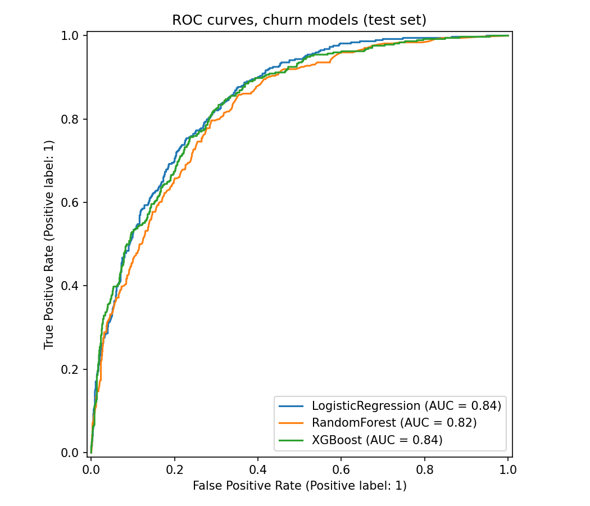
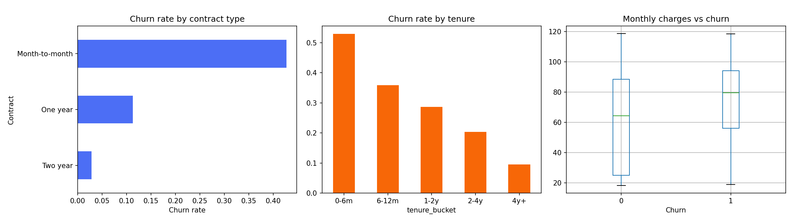

# churn-radar

[](https://github.com/ranjithguggilla/churn-radar/actions/workflows/ci.yml)
[](https://www.python.org/)
[](LICENSE)

A customer churn early-warning system for a telecom retention team. It scores
each customer's probability of cancelling, explains which account attributes
drive the risk, and recommends a retention action. The model ships behind a
FastAPI service with request validation, a Docker image, and a Gradio demo UI.

A churn score is only useful if it changes who the retention team calls. So
besides the usual classification metrics, the training run reports how many
real churners you reach by calling only the riskiest 20% of customers, and
roughly what that is worth in revenue.

## Results

Measured on a stratified 20% hold-out of 1,409 customers the models never saw
during training. All numbers are written to `outputs/metrics.json` by
`python -m churn_radar.train`.

| model | ROC-AUC | recall | precision | F1 |
|---|---|---|---|---|
| **logistic regression (class-balanced)** | **0.845** | **0.80** | 0.51 | 0.62 |
| XGBoost | 0.838 | 0.75 | 0.53 | 0.62 |
| random forest | 0.823 | 0.47 | 0.62 | 0.54 |

The simple, interpretable model wins. On a dataset of this size the gradient
boosting model does not beat a well-regularised linear model, so the service
ships logistic regression.

- **Targeting:** calling the top 20% of risk scores reaches 186 of 374 actual
  churners (50%), 2.5 times better than calling at random.
- **Impact:** assuming 30% of contacted churners are retained for a year, that
  protects about **$48.7K a year** on this 1,409-customer slice alone.




Month-to-month contracts, customers in their first six months, fiber-optic
plans, and electronic-check payers carry the most risk. These become the
plain-language risk drivers returned with every prediction.

## Quick start

```bash
python -m venv .venv && source .venv/bin/activate
pip install -r requirements-dev.txt && pip install -e .

python -m churn_radar.train              # train 3 models, save the best + metrics + charts
uvicorn churn_radar.api:app --reload     # REST API, docs at http://127.0.0.1:8000/docs
```

Optional extras:

```bash
pip install -r requirements-ui.txt && python -m churn_radar.app   # Gradio UI on :7860
pip install mlflow && python -m churn_radar.train --mlflow        # log runs to MLflow
```

On macOS, XGBoost needs the OpenMP runtime: `brew install libomp`.

## API

| method | path | purpose |
|---|---|---|
| GET | `/health` | liveness plus whether a trained model is loaded |
| POST | `/predict` | score one customer |
| POST | `/predict/batch` | score up to 1,000 customers in one call |

Field names match the IBM Telco columns, so a CRM export can be posted as-is.
Unknown fields and out-of-range values are rejected with a 422.

```bash
curl -X POST localhost:8000/predict -H 'Content-Type: application/json' -d '{
  "gender": "Female", "SeniorCitizen": 0, "Partner": "No", "Dependents": "No",
  "tenure": 3, "PhoneService": "Yes", "MultipleLines": "No",
  "InternetService": "Fiber optic", "OnlineSecurity": "No", "OnlineBackup": "No",
  "DeviceProtection": "No", "TechSupport": "No", "StreamingTV": "No",
  "StreamingMovies": "No", "Contract": "Month-to-month", "PaperlessBilling": "Yes",
  "PaymentMethod": "Electronic check", "MonthlyCharges": 80.0
}'
```

```json
{
  "churn_probability": 0.8644,
  "risk_tier": "high",
  "risk_drivers": [
    "month-to-month contract (top churn driver)",
    "very new customer (6 months tenure or less)",
    "fiber-optic plan, a price-sensitive segment",
    "pays by electronic check (historically churn-prone)",
    "no tech-support add-on"
  ],
  "recommended_action": "Call within 48 hours: offer a 1-year contract upgrade with a loyalty discount"
}
```

## Docker

```bash
docker build -t churn-radar .           # trains the model during the build
docker run -p 8000:8000 churn-radar
```

The image runs as a non-root user and has a health check on `/health`. CI
builds the image and smoke-tests `/predict` against it on every push.

## How it works

```
data/telco_churn.csv
  -> features.load_and_clean      fix blank TotalCharges, encode target
  -> features.engineer_features   tenure bucket, average monthly spend, service count
  -> train                        LogReg vs RandomForest vs XGBoost in one sklearn Pipeline
                                  (scaling + one-hot fitted on the training fold only)
  -> models/churn_model.joblib    best model by ROC-AUC
  -> api / app                    same features module, so inference = training transforms
```

| module | role |
|---|---|
| `features.py` | cleaning and feature engineering shared by training and inference |
| `train.py` | model comparison, charts, business-impact simulation, optional MLflow logging |
| `schemas.py` | Pydantic request and response models with strict value checks |
| `api.py` | FastAPI service with single and batch scoring |
| `explain.py` | risk tiers, plain-language drivers, retention actions |
| `app.py` | Gradio demo UI |

## Tests

```bash
ruff check src tests && pytest --cov=churn_radar
```

The tests cover data cleaning, parity between training and inference features,
API validation and batch limits, and a full training run. CI runs them on
Python 3.11 and 3.12.

## Data

[IBM Telco Customer Churn](https://github.com/IBM/telco-customer-churn-on-icp4d):
7,043 customers, 26.5% churn rate. Also on Kaggle as `blastchar/telco-customer-churn`.

## License

MIT
